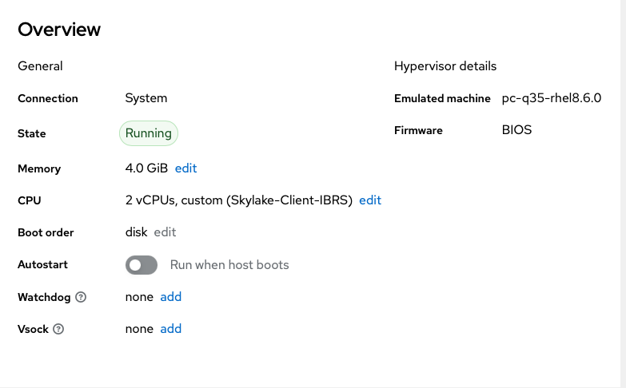
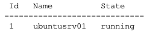
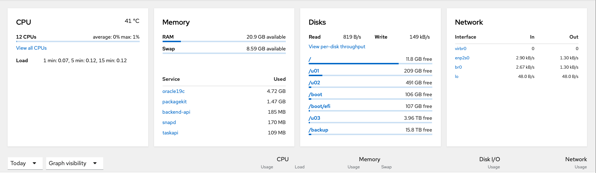
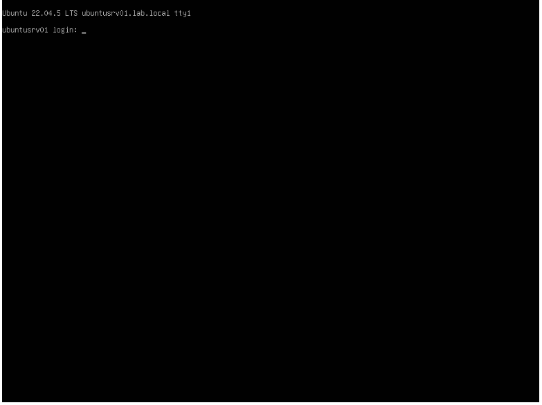

# 🧱 Home-Lab Virtualization Host — Oracle Linux 8 / KVM + Cockpit

## 🧭 Summary
Configured an Oracle Linux 8 hypervisor (**db01**) running KVM/libvirt with **Cockpit** for web-based VM management.  
Verified full virtualization stack operation, including VNC-accessible guest consoles via both Cockpit and direct QEMU ports.

---

## ⚙️ Environment
| Component | Details |
|------------|----------|
| **Host** | Oracle Linux 8 (db01.lab.local) |
| **Hypervisor** | KVM/QEMU via libvirt |
| **Management** | Cockpit 310 + `cockpit-machines` plugin |
| **Networking** | Bridge NAT on 192.168.88.0/24 |
| **Example VM** | ubuntusrv01 — Ubuntu Server 22.04 |
| **Console Access** | Cockpit web console (HTTPS :9090) and QEMU VNC (TCP :5900) |
| **Remote CLI** | SSH from macOS Terminal |

---

## 🧰 Skills Demonstrated
- Linux service management (systemd, firewall-cmd)  
- KVM/libvirt domain & network configuration  
- VNC and remote-desktop troubleshooting  
- Secure remote access over SSH  
- Cockpit plugin management  
- Repository version control (Git/GitHub via SSH keys)

---

## 🖼️ Screenshots

### Cockpit Dashboard

### Virtual Machines Panel

### VM Console View

### Terminal Verification

> *Note:* If your screenshot filenames differ, just change the file names in the Markdown above to match exactly.

---

## 📜 Notes
This project demonstrates a clean, maintainable home-lab hypervisor setup suitable for Oracle Database and backend development workloads.  
The environment mirrors small-scale production virtualization, using open-source tooling and secure management interfaces.

---

## 🔗 Repository Structure
